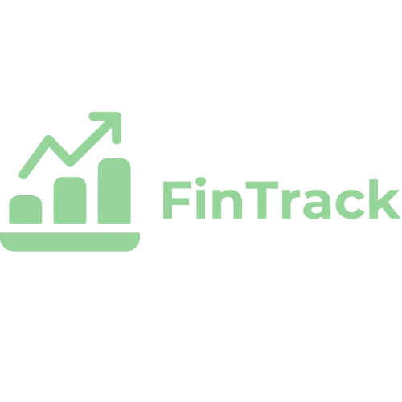

## 💰 AVAILABLE IN: [fintrackweb.vercel.app](https://fintrackweb.vercel.app)

### Description:

FinTrack is a responsive web application designed to help users manage their personal finances. Built with Python and Flask, HTML, CSS, JavaScript with Bootstrap, and PostgreSQL, the platform enables users to track their income and expenses efficiently. Users can easily register and log in to their accounts, categorize their financial transactions, and visualize their financial activity with graphs. In addition, FinTrack allows users to view their transactions grouped by month, helping them track their earnings and expenses over time.

### Features:

- User registration and login
- Account settings
- Record incomes and expenses with detailed information (amount, category, and title)
- View income and expense graphs
- Track monthly income and spending summaries

### Adding Transactions

In the "Add a Transaction" section, users can add new incomes or expenses. The transaction form allows users to select the category, input the amount, and provide a title for the transaction. This feature ensures that users can easily keep track of all financial activity and categorize it accurately.

### Languages and Tools:

- Python
- Flask
- HTML
- CSS
- JavaScript
- Chart.js
- Bootstrap
- PostgreSQL

### Contributing:

Contributions are welcome! Please fork the repository and submit a pull request. For major changes, please open an issue first to discuss what you would like to change.

### License:

This project is licensed under the MIT License.
